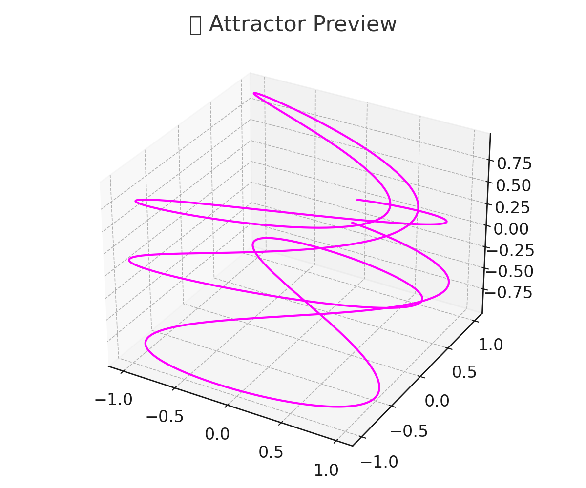

[](https://colab.research.google.com/github/happyeternitycompanydotcom/experiments-nlr-predictor/blob/main/nlr_predictor_colab.ipynb)

# 🧠 NLR-Predictor

An experimental nonlinear forecasting framework to predict profits from business ideas using LLM and dynamical systems.

## Project Status

Untested.

## Project History

 * 2025/07/20 Untested initial version 

## 📦 Features

- Nonlinear models (AutoEncoder + RNN)
- Idea vectorization
- Open LLM integration (Mistral via Ollama)
- Phase portrait visualization
- Google Colab .ipynb demo

## 🚀 Quickstart (Colab)

1. Open `nlr_predictor_colab.ipynb` in [Google Colab](https://colab.research.google.com/)
2. Follow the steps

## 🖥 Local Setup

1. Install dependencies:
```bash
pip install -r requirements.txt
```

2. Run notebook:
```bash
jupyter notebook nlr_predictor_colab.ipynb
```

---

## 📁 Structure

- `models/` — Nonlinear prediction models
- `llm/` — LLM integration (Ollama)
- `visualization/` — Phase attractor visualizations
- `data/` — Input ideas and embeddings


## 🌀 Attractor Preview


